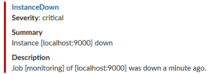
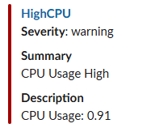
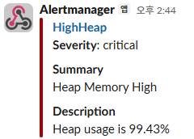

# SpringBootWithMonitoring

Prometheus와 AlertManager는 각각 설치가 필요하며, 테스트용 yml 설정 파일은 document 폴더에 포함.

## 알람 발생
1. Slack incoming-webhook api url을 발급받아서, alertmanager.yml에 입력
2. AlertManager 서버 실행
3. Prometheus 서버 실행
4. first_rules.yml에 작성한 rule 이벤트를 직접 발생시킴.
   - InstanceDown: 애플리케이션 종료
   - HighCPU: /test/cpu 여러번 호출
   - HighHeap: /test/heap 여러번 호출
5. 알람 발송(Slack 채널에 알람 메시지 왔는지 확인)

**InstanceDown 메시지**<br>


**HighCPU 메시지**<br>


**HighHeap 메시지**<br>


## Prometheus
**설정 파일과 함께 서버 실행**
```shell
./prometheus.exe --config.file=prometheus.yml
```

## AlertManager
**설정 파일과 함께 서버 실행**
```shell
./alertmanager.exe --config.file=alertmanager.yml
```